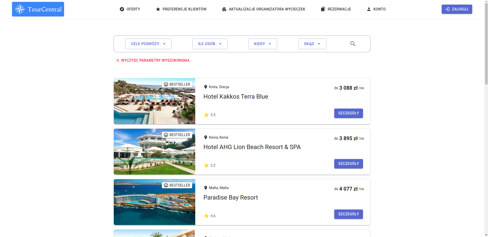
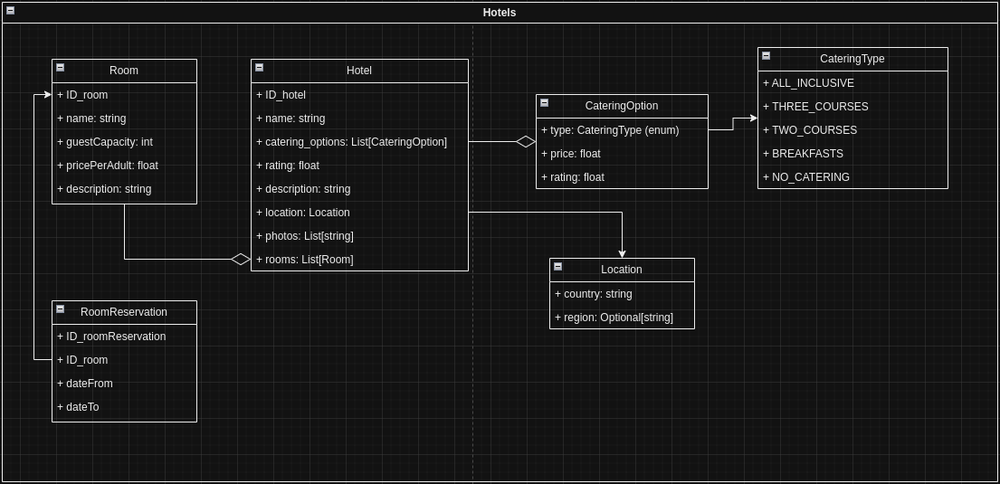
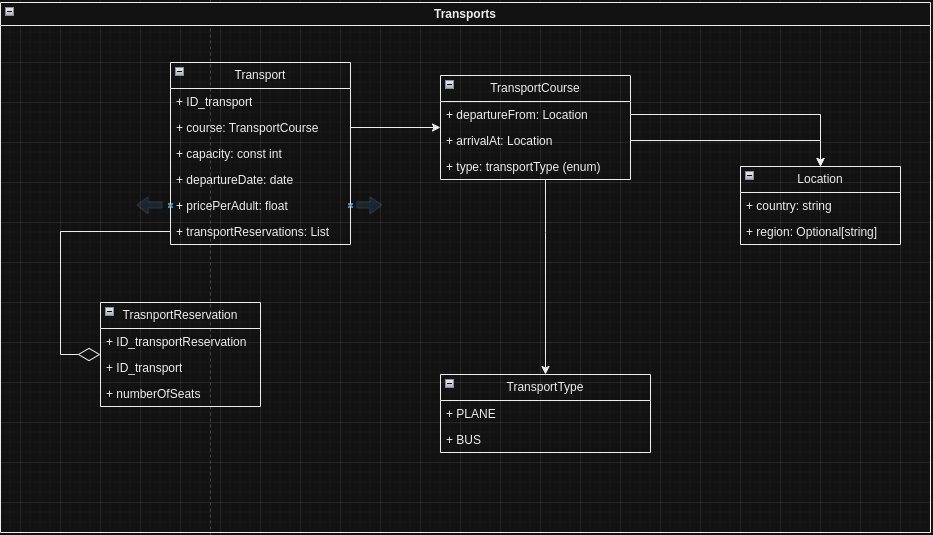
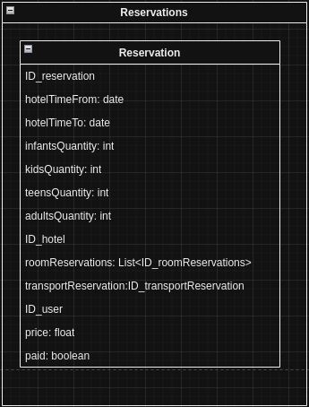
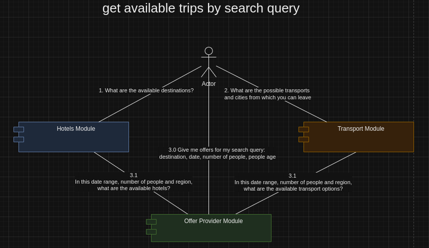
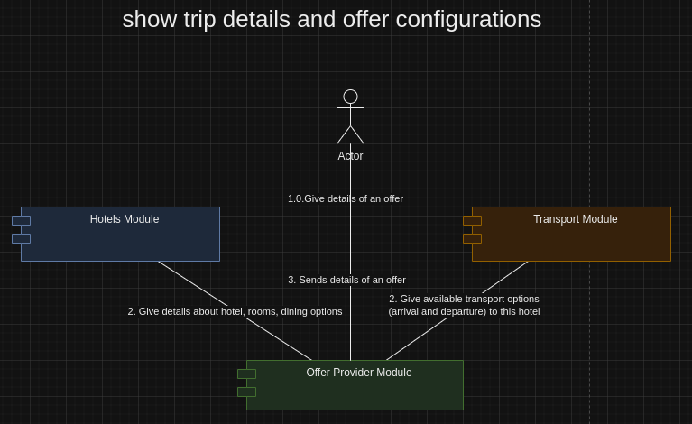
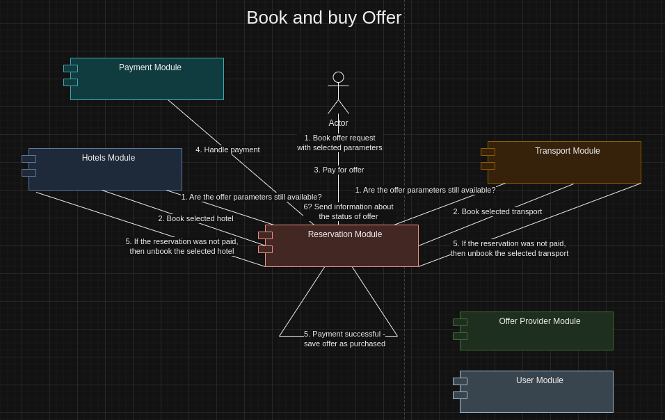

# Travel agency tour operator microservices project

The main topic of the project implementation is the
system for servicing customers interested in purchasing
tourist offers. This application is developed in
microservice architecture that uses brokered messages
for communication between components. Used CQRS, Event Sourcing and Saga patterns.

Frontend side of this project can be found [here](https://github.com/Microarchitecturovisco/travel-ui).

<div align="center">
  
</div>

## Table of contents
- [Technology](#technology)
- [Microservices architecture](#microservices-architecture)
- [Services description](#services-description)
- [Database schema](#database-schema)
- [Use Cases](#use-cases)
- [Using docker compose](#using-docker-compose)

## Technology

- **Framework:** Spring Boot
- **Discovery:** Eureka Discovery Service
- **Database:** H2 Database + Springa Data JPA + Hibernate Validator
- **Communication:** Spring AMQP with RabbitMQ
- **Maven**
- **Lombok**

## Microservices architecture

This project is devided into 9 modules:
- **api gateway** - entrypoint for every request; by default available at port `8082`
- **discovery service** - eureka-based discovery service
- **hotel service** - module responsilbe for managing hotels-oriented data
- **transport service** - module responsilbe for managing transports-oriented data
- **offer provider service** - module responsible for returning offers based on search query
- **reservation service** - module responsible for making reservations of selected offers
- **payment service** - payment logic (mocked)
- **user service** - user-oriented data
- **data generator** - additional module for seeking live changes of the hotel and transport data

**RabbitMQ** is used as the message broker.


## Services description

- **offer provide service** - This service provides offers for users. It communicates through queues with transports and hotels to get available hotels/rooms and transport at certain period and connect it to present available offers (transport + rooms) to user. It also provides detailed view of specific offer with data collected from hotel module.

- **reservation service** - This service orchestrates the process of reservation with usaged of saga pattern. It communicated with hotel service and transport service to reserve needed resources. If during reservation, any of the resource is not available, then it communicate with the provider of resource already booked to unreserve the resource. Alos when the payment is unsuccesfull, then all resources are freed.

- **hotel service** - This service stores hotel data such as hotel details, room details and room reservation. It provides information about avaivability of a room/hotel to offer provider and reservation service and shares an option with reservation service to reserve certain rooms.

- **transport service** - This service stores data about transports and transport reservations. It provides information about avaivability of a certain transport to offer provider and reservation service and shares an option with reservation service to reserve a transport.

## Database Schema
We use the CQRS pattern and Event Sourcing to manage databases

### Hotels database
<div align="center">
  
</div>

### Transports database
<div align="center">
  
</div>

### Reservations database
<div align="center">
  
</div>


## Use cases

- **Get offer based on search query** - Firstly user asks Transport Module for all cities from which you can leave and Hotel Module for all cities to which you can go. Then user send search query for desired cities with parameters like dates and number of people in different age. After that Offer Provider asks Hotel and Transport Moduls for all Hotels and Transports that satisfies those conditions. After getting both answers Offer Provider combines them and send to user all available offers (Hotel + Transport).

<div align="center">
  
</div>

- **Get offer details** - In this scenario, user chooses from previous step an offer of which he would like to get more details. Information request is sent to offer provider which asks Hotel module about the details of Hotel and rooms availability for specific configuration, and Transport Module for details about the Transport. After combining both answers and calculating price, all information are sent to user, which then is able to choose room configuration, dining option and departure city. Changing any of these parameter results in changing price which is visible on frontend in real time, thanks to use of web sockets. Web sockets are also used to show information about reservation made by another user of a hotel related to offer which you are seeing.

<div align="center">
  
</div>

- **Book and buy offer** - After choosing all parameters you can reserve an offer. It starts with sending information to Reservation Module about willingness to reserve an offer. Reservation Module checks if choosen transport and hotel is available. If so, then both are beeing booked. If any resource is no more not avaialble then the second resource is freed and information about failure is sent to user. After succesfully booking transport and hotel, Payment module handle the payment from user. If the payment is succesfull user gets information about booked offer. If it's not, then all resources are freed, and user gets information about failure.

<div align="center">
  
</div>


## Using-docker-compose

To start all services use this command in the project root directory:
```bash
docker compose up -d
```

This command will also optionally build the .jars if they aren't already packaged.

To stop all associated containers, run:
```bash
docker compose down
```

